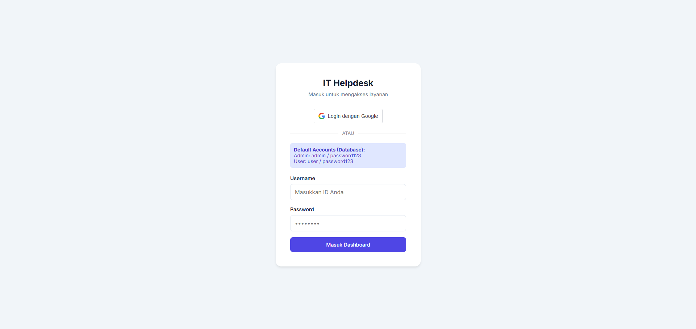
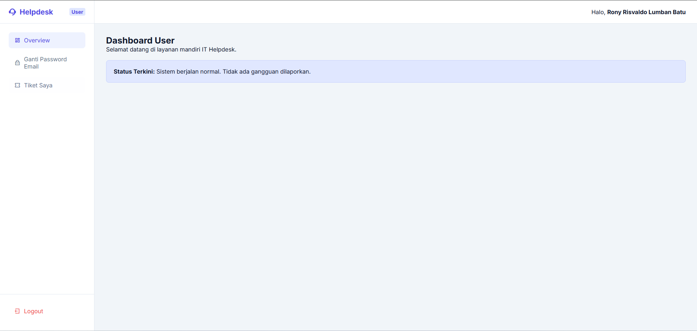
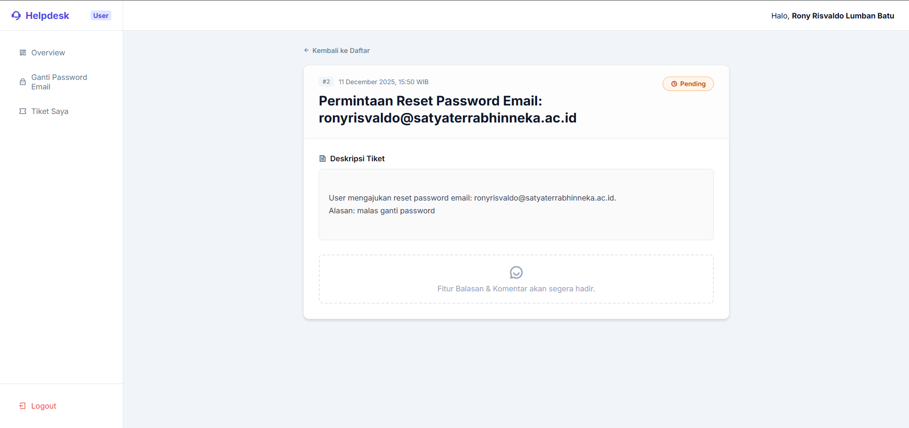
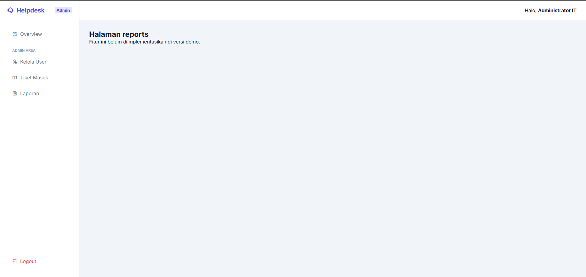

# 🎫 IT Helpdesk System


Aplikasi **IT Helpdesk** modern berbasis web untuk mengelola tiket dukungan teknis, pelaporan insiden, dan permintaan layanan IT di **Universitas Satya Terra Bhinneka**. Dibangun dengan PHP Native yang bersih, performa tinggi, dan mudah dikembangkan.

---

## ✨ Fitur Utama

### 🔐 Otentikasi & Keamanan
*   **Login Aman**: Hashing password `Bcrypt`.
*   **Google OAuth 2.0**: Login SSO menggunakan email kampus (@satyaterrabhinneka.ac.id).
*   **Role-Based Access Control (RBAC)**:
    *   **Admin**: Hak akses penuh (Kelola Tiket, User, Laporan).
    *   **Staff**: User internal kampus.
    *   **Mahasiswa**: User Mahasiswa.
    *   **User**: User umum.
*   **Session Management**: Proteksi CSRF & Session Hijacking.

### 👤 Portal User (Mahasiswa/Staff)
*   **Dashboard Personal**: Ringkasan aktivitas tiket.
*   **Buat Tiket Baru**: Form pengajuan masalah yang mudah.
*   **Diskusi Tiket**: Chat interaktif dengan Admin di dalam detail tiket.
*   **History Tiket**: Melacak status (Pending, In Progress, Resolved).

### 🛠️ Portal Admin
*   **Dashboard Statistik**: Grafik Tren Tiket & Distribusi Status (Chart.js).
*   **Manajemen Tiket**: Filter, Balas Komentar, Update Status.
*   **Manajemen User**: Tambah, Edit, Reset Password User.

---

## 💻 Cara Install & Menjalankan

### Prasyarat
*   PHP >= 8.0
*   MySQL Server (XAMPP/Laragon)
*   Composer (Opsional)

### Langkah 1: Clone Repository
```bash
git clone https://github.com/RonyRisvaldoLumbanBatu/it-helpdesk.git
cd it-helpdesk
```

### Langkah 2: Setup Database
1.  Buat database manual bernama `it_helpdesk`.
2.  Import file `database/database.sql` ke database tersebut.
3.  **PENTING**: Jalankan migrasi tambahan untuk fitur terbaru (Role & Komentar):
    ```bash
    php database/migrations/migrate_roles.php
    php database/migrations/migrate_comments.php
    ```

### Langkah 3: Konfigurasi
Copy/Edit file `config/database.php` sesuai setting lokal Anda:
```php
define('DB_HOST', 'localhost');
define('DB_NAME', 'it_helpdesk');
define('DB_USER', 'root');
define('DB_PASS', '');
```

**Setup Google Login (Opsional):**
1.  Buka `views/login.php` dan `views/actions/auth_google.php`.
2.  Ganti `CLIENT_ID` dengan ID dari Google Cloud Console Anda.
3.  Pastikan `Authorized Origins` di Google Console mencakup `http://localhost:8000`.

### Langkah 4: Jalankan Aplikasi
**Windows (Disarankan):**
Double klik file **`dev.bat`**.

**Manual:**
```bash
php -S localhost:8000 -t public
```
Akses di browser: **http://localhost:8000**

---

## 📸 Screenshots

| Login Page | Dashboard Admin |
| :---: | :---: |
|  |  |

| Detail Tiket & Chat | Laporan Grafik |
| :---: | :---: |
|  |  |

---

## 🔑 Akun Demo (Default)

| Role | Username | Password |
| :--- | :--- | :--- |
| **Administrator** | `admin` | `password123` |
| **User Biasa** | `user` | `password123` |

> ⚠️ **Catatan SSO:** Login Google hanya bekerja untuk email `@satyaterrabhinneka.ac.id`. Role akan otomatis diset ke **Staff** atau **Mahasiswa** berdasarkan domain email.

---

Built with ❤️ by **Rony (Tim PDSI)**.
