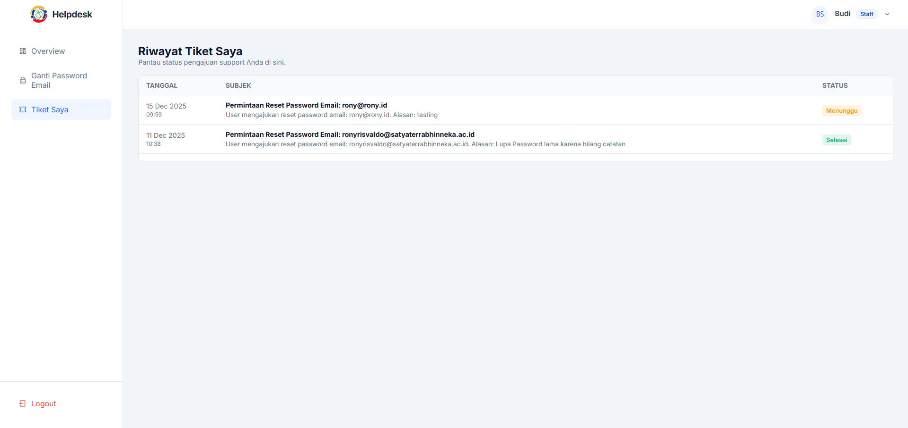
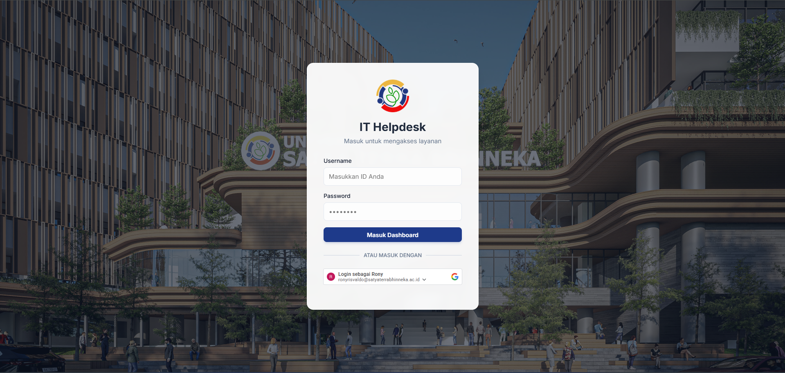
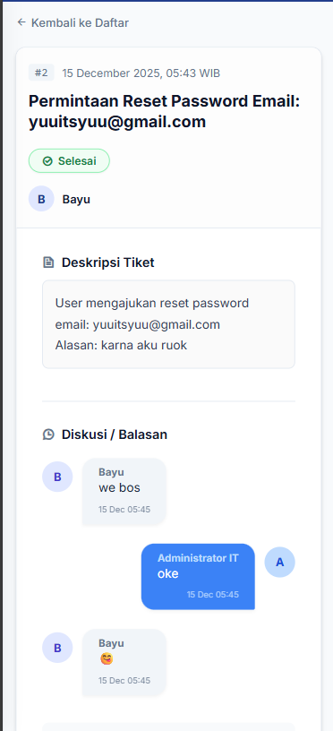
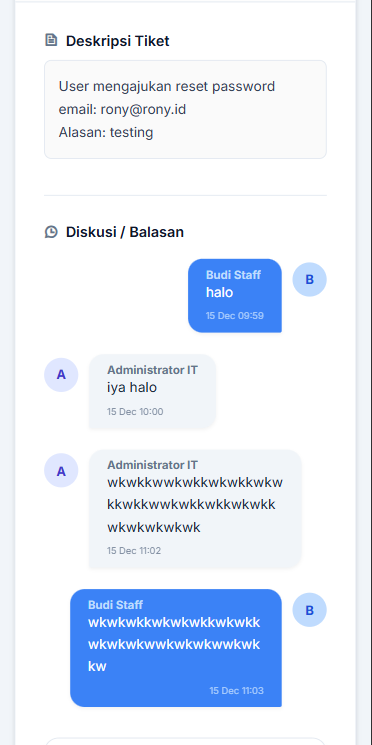

# 🎫 IT Helpdesk Premium System (Bahasa Indonesia Version)


> **"Bukan Sekadar Sistem Tiket Biasa. Ini Adalah Revolusi Pengalaman Support Internal."**

Apakah Anda lelah dengan tampilan aplikasi kantor yang kaku, lambat, dan membosankan?  
Kami mengubah paradigma itu. **IT Helpdesk System** ini dibangun dengan dedikasi tinggi pada *User Experience (UX)* dan estetika antarmuka (*UI*), memberikan nuansa aplikasi modern kelas dunia langsung ke lingkungan kerja Anda.

---

## 🚀 Mengapa Anda Akan Menyukainya?

Kebanyakan sistem internal perusahaan dibuat "asal jalan". Proyek ini dibuat untuk **dinikmati**.
Kami menggabungkan performa tinggi **Native PHP** dengan **Modern CSS** untuk menciptakan pengalaman yang mulus, responsif, dan menyenangkan.

### ✨ Fitur Unggulan yang Memanjakan Mata:
*   **Antarmuka Dashboard Premium**: Tampilan bersih, kartu aktivitas yang interaktif, dan statistik yang mudah dibaca.
*   **Diskusi Tiket Gaya WhatsApp**: Lupakan email berantai. Ngobrol dengan tim support layaknya *chatting* dengan teman. Cepat, realtime, dan intuitif.
*   **Responsif di Segala Perangkat**: Sempurna di Laptop, Tablet, maupun Smartphone. Ikon tidak gepeng, layout tidak berantakan.
*   **Filter & Pencarian Pintar**: Pantau tiket "Menunggu", "Diproses", atau "Selesai" dalam sekali klik.
*   **Lokalisasi Penuh**: Menggunakan Bahasa Indonesia yang baku namun tetap luwes untuk memudahkan komunikasi.

---

## 📸 Jelajahi Tampilan (Dokumentasi)

Lihat bagaimana kami mentransformasi proses *support* menjadi pengalaman visual yang menarik.

### 1. Dashboard Utama yang Informatif
Pusat kontrol Anda. Pantau status tiket, aktivitas terbaru, dan statistik penting dalam satu pandangan.



### 2. Gerbang Masuk Modern (Login)
Kesan pertama itu penting. Halaman login yang aman, simpel, dan elegan.



### 3. Pengalaman Chatting Tanpa Batas
Antarmuka percakapan yang dirancang khusus untuk kejelasan komunikasi.

#### 📱 Tampilan Mobile (Responsif)
Tetap produktif di mana saja. UI beradaptasi sempurna dengan layar kecil.



#### 💻 Tampilan Desktop (Luas & Detail)
Memanfaatkan lebar layar untuk menampilkan informasi secara maksimal.



---

## 🛠️ Dapur Pacu (Tech Stack)

Kami percaya pada kekuatan kesederhanaan. Tanpa framework berat, tanpa *bloatware*. Murni performa.

-   **Bahasa Utama**: PHP 8+ (Native) - Kencang & Stabil.
-   **Database**: MySQL - Penyimpanan data yang relasional dan aman.
-   **Gaya (Styling)**: Vanilla CSS Modern (Flexbox & Grid) - Ringan & Fleksibel.
-   **Aset Ikon**: Remix Icon - Konsisten & Tajam.
-   **Font**: Google Fonts (Inter) - Keterbacaan tinggi.

---

## ⚙️ Cara Instalasi (Coba Sekarang!)

Penasaran ingin mencobanya di komputer Anda? Ikuti langkah mudah ini:

1.  **Clone Repository Ini**
    ```bash
    git clone https://github.com/RonyRisvaldoLumbanBatu/it-helpdesk.git
    cd it-helpdesk
    ```

2.  **Siapkan Database**
    -   Buat database baru di MySQL (misal: `db_helpdesk`).
    -   Import file SQL yang sudah kami sediakan: `database/db_helpdesk.sql`.
    -   Sesuaikan koneksi di file `src/Database.php` atau konfigurasi terkait.

3.  **Jalankan Server**
    Gunakan built-in server PHP agar instan:
    ```bash
    php -S localhost:8000 -t public
    ```
    Buka browser dan kunjungi: `http://localhost:8000`

4.  **Akun Demo**
    -   **Admin**: `admin@contoh.com` / `password123`
    -   **User**: `user@contoh.com` / `password123`

---

## 🤝 Kontribusi

Punya ide gila untuk fitur baru? Atau menemukan *bug* kecil? Kami sangat terbuka untuk kolaborasi!
Jangan ragu untuk *Fork*, *Clone*, dan kirimkan *Pull Request* terbaik Anda.

---

<center>
  <p>Dibuat dengan ❤️ dan semangat inovasi oleh <b>Rony Risvaldo</b></p>
  <small>Experience the difference of a well-crafted tool.</small>
</center>
