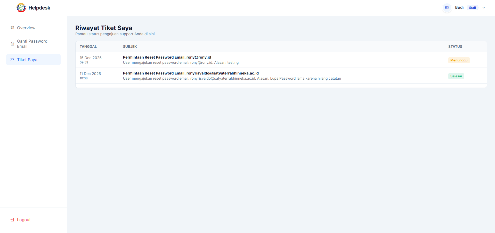
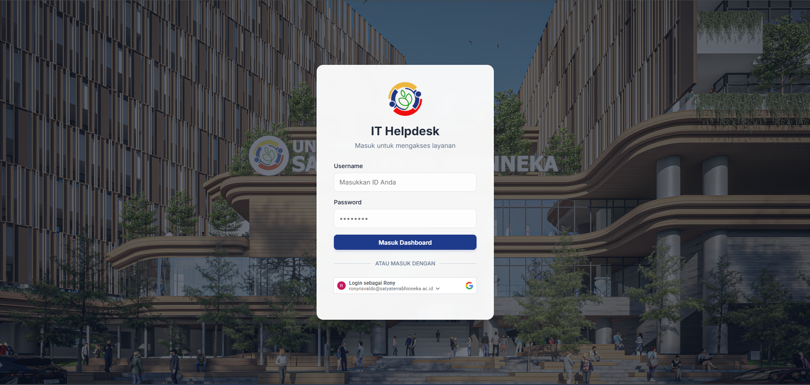
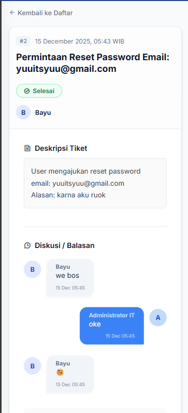
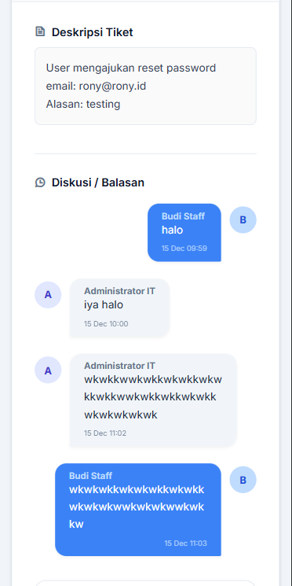

# 🎫 IT Helpdesk Premium System (Bahasa Indonesia Version)


> **"Bukan Sekadar Sistem Tiket Biasa. Ini Adalah Revolusi Pengalaman Support Internal."**

Apakah Anda lelah dengan tampilan aplikasi kantor yang kaku, lambat, dan membosankan?  
Kami mengubah paradigma itu. **IT Helpdesk System** ini dibangun dengan dedikasi tinggi pada *User Experience (UX)* dan estetika antarmuka (*UI*), memberikan nuansa aplikasi modern kelas dunia langsung ke lingkungan kerja Anda.

---

## 🚀 Mengapa Anda Akan Menyukainya?

Kebanyakan sistem internal perusahaan dibuat "asal jalan". Proyek ini dibuat untuk **dinikmati**.
Kami menggabungkan performa tinggi **Native PHP** dengan **Modern CSS** untuk menciptakan pengalaman yang mulus, responsif, dan menyenangkan.

### ✨ Fitur Unggulan yang Memanjakan Mata:
*   **Antarmuka Dashboard Premium**: Tampilan bersih, kartu aktivitas yang interaktif, dan statistik yang mudah dibaca.
*   **Diskusi Tiket Gaya WhatsApp**: Lupakan email berantai. Ngobrol dengan tim support layaknya *chatting* dengan teman. Cepat, realtime, dan intuitif.
*   **Responsif di Segala Perangkat**: Sempurna di Laptop, Tablet, maupun Smartphone. Ikon tidak gepeng, layout tidak berantakan.
*   **Filter & Pencarian Pintar**: Pantau tiket "Menunggu", "Diproses", atau "Selesai" dalam sekali klik.
*   **Lokalisasi Penuh**: Menggunakan Bahasa Indonesia yang baku namun tetap luwes untuk memudahkan komunikasi.

---

## 📸 Jelajahi Tampilan (Dokumentasi)

Lihat bagaimana kami mentransformasi proses *support* menjadi pengalaman visual yang menarik.

### 1. Dashboard Utama yang Informatif
Pusat kontrol Anda. Pantau status tiket, aktivitas terbaru, dan statistik penting dalam satu pandangan.



### 2. Gerbang Masuk Modern (Login)
Kesan pertama itu penting. Halaman login yang aman, simpel, dan elegan.



### 3. Pengalaman Chatting Tanpa Batas
Antarmuka percakapan yang dirancang khusus untuk kejelasan komunikasi.

#### 📱 Tampilan Mobile (Responsif)
Tetap produktif di mana saja. UI beradaptasi sempurna dengan layar kecil.



#### 💻 Tampilan Desktop (Luas & Detail)
Memanfaatkan lebar layar untuk menampilkan informasi secara maksimal.



---

## 🛠️ Dapur Pacu (Tech Stack)

Kami percaya pada kekuatan kesederhanaan. Tanpa framework berat, tanpa *bloatware*. Murni performa.

-   **Bahasa Utama**: PHP 8+ (Native) - Kencang & Stabil.
-   **Database**: MySQL - Penyimpanan data yang relasional dan aman.
-   **Gaya (Styling)**: Vanilla CSS Modern (Flexbox & Grid) - Ringan & Fleksibel.
-   **Aset Ikon**: Remix Icon - Konsisten & Tajam.
-   **Font**: Google Fonts (Inter) - Keterbacaan tinggi.

---

## ⚙️ Cara Instalasi

Pilih metode instalasi yang sesuai dengan kebutuhan Anda:

### 🐳 **Opsi 1: Deployment dengan Docker (Recommended)**

Cara tercepat dan termudah untuk deploy aplikasi. Semua dependency dan database otomatis ter-setup!

**Prerequisites:**
- Docker & Docker Compose ter-install

**Langkah-langkah:**

1. **Clone Repository**
   ```bash
   git clone https://github.com/RonyRisvaldoLumbanBatu/it-helpdesk.git
   cd it-helpdesk
   ```

2. **Deploy dengan Satu Command!**
   ```bash
   docker-compose up -d --build
   ```

3. **Akses Aplikasi**
   Buka browser dan kunjungi: `http://localhost:7000`
   
   Database otomatis dibuat dengan semua tabel yang diperlukan! ✅

4. **Management Commands**
   ```bash
   # Lihat status containers
   docker-compose ps
   
   # Lihat logs
   docker-compose logs -f
   
   # Stop aplikasi
   docker-compose down
   
   # Restart
   docker-compose restart
   ```

**Features Docker Setup:**
- ✅ Multi-stage build (image lebih kecil)
- ✅ OPcache enabled (performance boost)
- ✅ Security headers (production-ready)
- ✅ Health checks (auto-restart jika error)
- ✅ Resource limits (CPU & Memory)
- ✅ Network isolation
- ✅ MySQL 8.0 dengan UTF8MB4

---

### 💻 **Opsi 2: Local Development (Manual Setup)**

Untuk development lokal tanpa Docker.

**Prerequisites:**
- PHP 8.2+ ter-install
- MySQL/MariaDB ter-install
- Web server (Apache/Nginx) atau PHP built-in server

**Langkah-langkah:**

1. **Clone Repository**
   ```bash
   git clone https://github.com/RonyRisvaldoLumbanBatu/it-helpdesk.git
   cd it-helpdesk
   ```

2. **Siapkan Database**
   - Buat database baru di MySQL:
     ```sql
     CREATE DATABASE it_helpdesk CHARACTER SET utf8mb4 COLLATE utf8mb4_unicode_ci;
     ```
   - Import file SQL:
     ```bash
     mysql -u root -p it_helpdesk < database/database.sql
     ```

3. **Konfigurasi Database**
   Edit file `config/database.php` sesuaikan dengan setup MySQL Anda:
   ```php
   'host' => 'localhost',
   'database' => 'it_helpdesk',
   'username' => 'root',
   'password' => 'your_password'
   ```

4. **Jalankan Server**
   ```bash
   php -S localhost:8000 -t public
   ```
   Buka browser: `http://localhost:8000`

---

### 🔐 **Akun Demo / Default Login**

Setelah instalasi, gunakan kredensial berikut untuk login:

| Role | Username | Password |
|------|----------|----------|
| **Admin** | `admin` | `password123` |

⚠️ **CATATAN**: 
- Hanya akun **Admin** yang tersedia secara default
- Akun **User** dan **Staff** tidak ada di database awal
- Admin dapat membuat akun User/Staff melalui halaman **Kelola Pengguna**
- **SANGAT PENTING**: Segera ganti password default setelah login pertama kali!

---

## 🤝 Kontribusi

Punya ide gila untuk fitur baru? Atau menemukan *bug* kecil? Kami sangat terbuka untuk kolaborasi!
Jangan ragu untuk *Fork*, *Clone*, dan kirimkan *Pull Request* terbaik Anda.

---

<center>
  <p>Dibuat dengan ❤️ dan semangat inovasi oleh <b>Rony Risvaldo</b></p>
  <small>Experience the difference of a well-crafted tool.</small>
</center>
